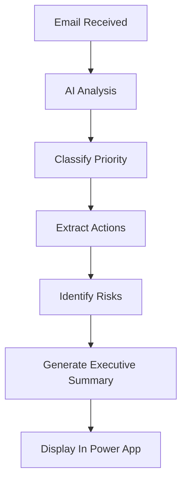

<div align="center">

# 🚀 Skunkworks Africa
### High-Priority Follow-Ups


## 📌 Overview

The **High-Priority Follow-Ups** application helps executives, sales teams, account managers, and operations leaders identify the most important actions hidden within large volumes of email communication.

Using Microsoft Copilot intelligence, the application analyzes email activity and surfaces:

✅ Urgent follow-ups  
✅ Customer opportunities  
✅ Financial matters  
✅ Operational issues  
✅ Pending approvals  
✅ Strategic risks  
✅ Action items requiring attention

---

## ✨ Key Features

### 🔴 Priority Classification

Automatically identifies:

- Critical customer requests
- Escalated support issues
- Unanswered emails
- Management decisions
- High-risk communications

---

### 💰 Revenue Opportunity Detection

Highlights:

- New leads
- RFQs
- Tender opportunities
- Upsell opportunities
- Partnership requests
- Training requests

---

### 📊 Executive Briefing Dashboard

Generate concise summaries including:

| Category | Purpose |
|-----------|----------|
| Opportunities | Revenue growth |
| Risks | Potential threats |
| Operations | Business continuity |
| Finance | Billing & invoices |
| Follow-Ups | Outstanding actions |

---

### 🤖 AI-Powered Insights

Microsoft Copilot identifies:

- Hidden trends
- Follow-up requirements
- Meeting preparation items
- Escalations
- Business opportunities

---

## 🎯 Business Benefits

<div align="center">

| Benefit | Outcome |
|----------|----------|
| Faster Decisions | Reduce information overload |
| Better Customer Service | Never miss important requests |
| Increased Revenue | Identify opportunities sooner |
| Improved Accountability | Track follow-up actions |
| Enhanced Productivity | Save executive time |

</div>

---

## 📱 Application Experience

### Home Screen

```text
┌─────────────────────────────┐
│  Skunkworks Africa          │
│ High-Priority Follow-Ups    │
├─────────────────────────────┤
│ 🔴 Urgent                   │
│ 🟠 Important                │
│ 🟢 Informational            │
└─────────────────────────────┘
```

### Executive View

```text
┌─────────────────────────────┐
│ Opportunities         12    │
│ Pending Actions       23    │
│ Customer Escalations   3    │
│ Outstanding Invoices   7    │
└─────────────────────────────┘
```

---

## 🏗 Architecture


---

## 🔄 Process Flow



---

## 🛠 Technology Stack

| Technology | Purpose |
|------------|---------|
| Power Apps | User Experience |
| Power Automate | Workflow Automation |
| Microsoft Copilot | AI Analysis |
| Outlook | Email Source |
| Dataverse | Data Storage |
| Dynamics 365 | Customer Context |

---

## 👥 Target Users

### Executive Leadership

- CEO
- COO
- CFO
- Managing Directors

### Sales Teams

- Account Managers
- Business Development Managers
- Sales Directors

### Operations

- Project Managers
- Service Delivery Teams
- Customer Success Teams

---

## 📈 Example Business Insight

### Opportunity

**IBM Freelance Trainer Requirement**

**Potential Value**

- Training revenue opportunity
- New partner relationship
- Future academy engagements

### Action Required

- Submit trainer profile
- Confirm availability
- Provide pricing

---

## 🔒 Security

The solution leverages Microsoft's enterprise platform security:

- Azure AD Authentication
- Role-Based Access Control
- Dataverse Security Roles
- Microsoft 365 Compliance
- Audit Logging

---

## 🌍 About Skunkworks Africa

**Skunkworks Africa** helps organizations accelerate digital transformation through:

- Microsoft Solutions
- AI Enablement
- Cloud Architecture
- Learning Solutions
- Power Platform Development
- Business Automation

---

<div align="center">

## 🚀 Built With Microsoft Power Platform

**Skunkworks Africa**

*Innovate • Automate • Transform*

</div>
